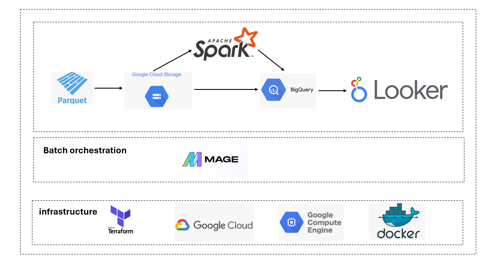

# data-engineering-zoomcamp-project

## Project summary
In this data engineering project, we set up a cloud based batch data pipeline to ingest, process and visualize S&P 500 data. The Standard and Poor's 500 or S&P 500 is the most famous financial benchmark in the world. This stock market index tracks the performance of 500 large companies listed on stock exchanges in the United States.

Goal of analysis was to understand volume trend for the S&P500 from 2010 to present. One interesting use of this type of analysis is to understand market anomalies and shocks. During those shock periods (say a crash)the volume traded in the market tends to spike. Of course there are more rigorous analysis to answer this type of question but that's outside the scope of project.

While the data isn't particularly large, my goal for this project was to demonstrate building a scalable end to end data engineering & visualization pipeline thereby practicing & curating knowledge learnt from the data engineering zoomcamp program so far. Nevertheless, I expect the infrastructure to scale even for larger data set.

## Technologies used
- Terraform - Infrastructure-as-Code (IaC) tool & automatic provisioning of cloud resources;  
- Docker & Docker-compose- containerization  
- Google cloud service - cloud service provider used  
- Google Compute Engine - virtual machine  
- Google Cloud Storage (GCS) - for data lake storage needs  
- Google BigQuery - for  Data Warehouse  
- Spark - for data transformations  
- Google Looker studio - for project data visualizations.  
- Mage - for orchestration of pipelines  

## Project architecture

## Mage orchestration/pipeline
Mage pipeline is show below, pipeline is scheduled to run monthly.

## Data source and schema
We use kaggle S&P500 data which can be found here:
https://www.kaggle.com/datasets/andrewmvd/sp-500-stocks

## Report & Discussion
### looker report link
https://lookerstudio.google.com/u/0/reporting/e990566e-53de-42d0-b816-045eb529e9aa/page/cPswD/edit

## Some insights from analysis
-Apple appears to be one of the most traded S&P500 stock.  
-We can see peak volume trends around 2010 during the global financial crisis.  
-In general the maximum volume traded over time seems to have dropped which is a bit interesting or could just be a due to data processing artefact, and might warrant further investigation.  

## Future work
These are some ideas I plan to explore in future:
-redo project but using a streaming data source  
-expand on spark pipeline  
-extend analysis and potentially use machine learning to predict onset of market shocks  
-edit visualization to allow for filtering  

